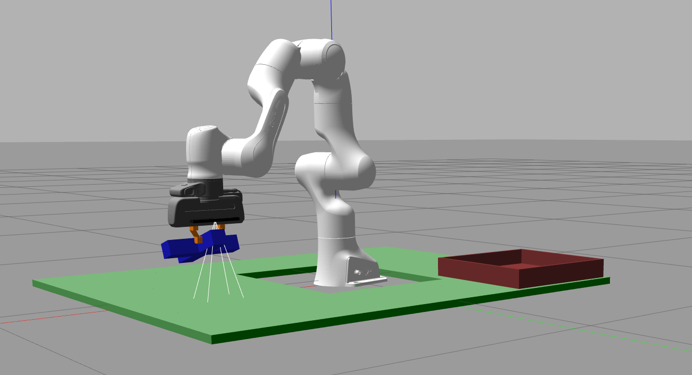
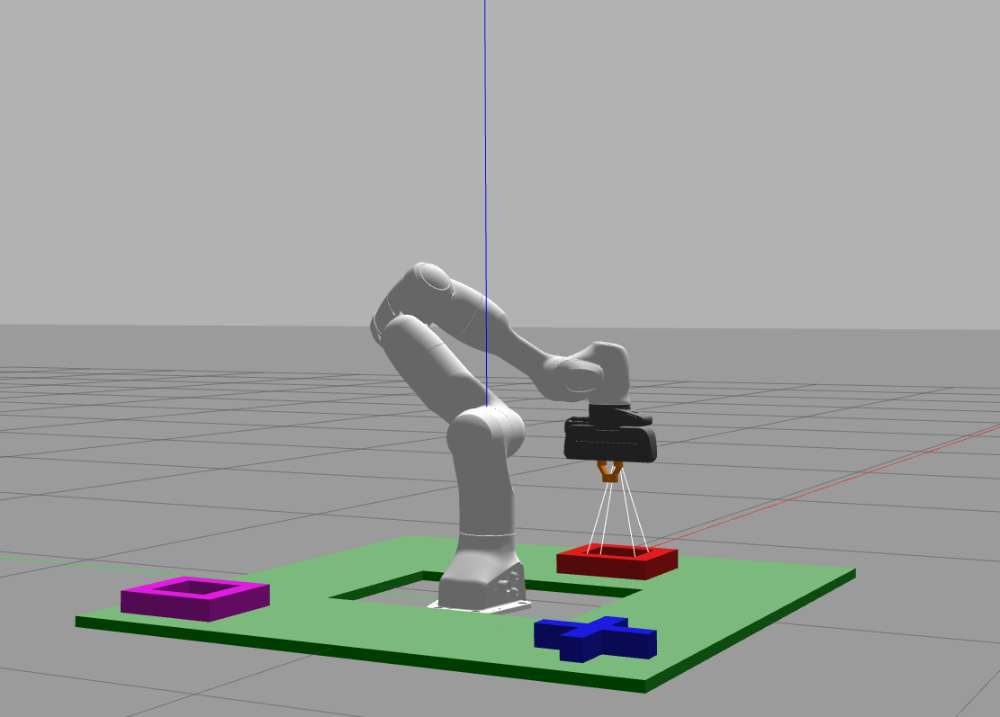
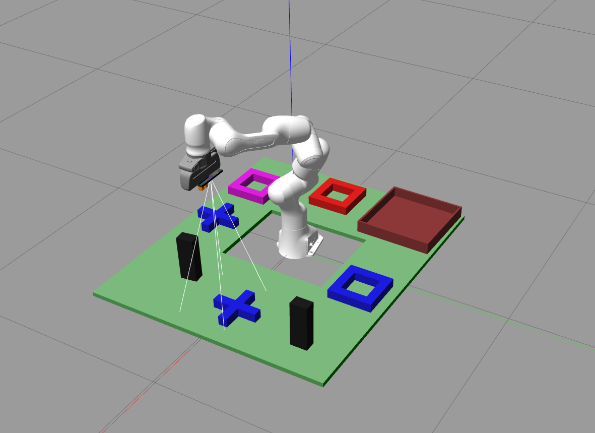

# COMP0129 Coursework 3 Team 2 

Created by Colin Laganier, Jacob Nash, Carl Parsons as part of COMP0129 of UCL's MSc of Robotics and Computation.

## Requirements

To run this task following packages are required: 
- ROS Noetic
- Point Cloud Library
- MoveIt
- Octomap

## Usage

Download the repository and add it as a package in your catkin environment (in /src folder). To build the package run in one terminal: 
```console
foo@bar:~/catkin_ws$ catkin build
```

To start the code, use the provided launch script:
```console
foo@bar:~/catkin_ws$ source devel/setup.bash
foo@bar:~/catkin_ws$ roslaunch cw3_team_2 run_solution.launch
```

The specific tasks should be launched from a separate, sourced terminal. 

## Description 


### Task 1
*Colin %, Jacob %, Carl % ( hour)*




```console
foo@bar:~catkin_ws$ rosservice call /task 1
```
### Task 2
*Colin %, Jacob %, Carl % ( hour)*




```console
foo@bar:~catkin_ws$ rosservice call /task 2
```

### Task 3
*Colin %, Jacob %, Carl % ( hour)*




```console
foo@bar:~catkin_ws$ rosservice call /task 3
```

---
Github Repo: https://github.com/colinlaganier/COMP0129-CW3

This project is [MIT](LICENSE) licensed.

